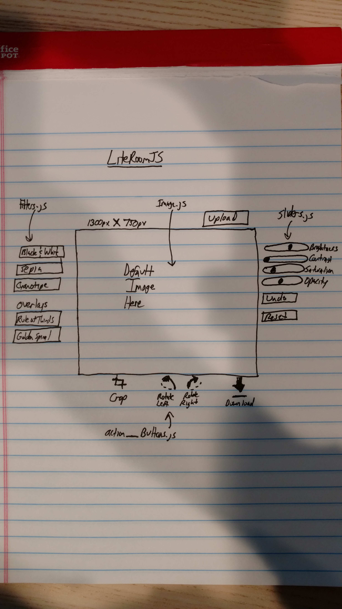

# LiteRoomJS

## Background

LiteRoomJS is a lightweight photo editor that enables web-based editing
of photographs, all without having to use a desktop application such as Adobe Lightroom.

### Functionality & MVP  

MVP functionality includes common use cases such as:

- [ ] Sliders to control brightness, contrast, saturation, etc.
- [ ] Color filters for grayscale, sepia, etc.
- [ ] Import/export image
- [ ] Toggle orientation between landscape and portrait

### Wireframes

### Architecture and Technologies

LiteRoomJS plans to implement core image edit functionality using:

- Vanilla JavaScript and `jquery` for slider, button, and filter logic
- `CSS3` to manipulate image color, orientation, and aesthetic.
- Webpack to bundle and serve up JS files.

In addition to the webpack entry file, there will be four .JS files:

`image.js`: initialize core logic of the image canvas, including export/import

`sliders.js`: logic to update CSS3 properties

`filters.js`: functions to apply color filters such as grayscale

`action_buttons.js`: handle button function, e.g. orientation and cropping

### Implementation Timeline

**Day 1**:
- Set up project skeleton with webpack and node.js.
- Create front end HTML components
- Basic styling of sliders, buttons, and default image

**Day 2**:
- Implement CSS3 slider logic

**Day 3**:
- Filter logic for grayscale, sepia, etc.
- Button logic for orientation / image rotation

**Day 4**:
- Import/export functionality
- Bonus features, if time

### Bonus features

- [ ] User ad-hoc cropping, aspect ratio cropping
- [ ] Dodging and burning
- [ ] Rule of thirds and golden spiral overlay
